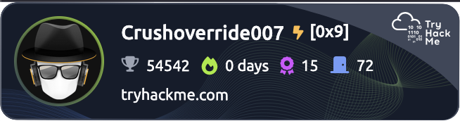

<!-- Introduction -->

<h2 align="center">Oh, Hello there 👋</h1>

<a href="https://git.io/typing-svg">

<!-- very old one, typing intro -->

<!--  -->

<!-- before typing intro -->

<!--   -->

<!-- New Typing Intro -->

<!-- latest one

-->

</a>

<!-- Stats -->

  

  
  <!-- <a href="https://visitor-badge.glitch.me/badge?page_id=Crushoverride007.Crushoverride007&left_text=All%20Visitors">
    
  from fleet
  </a> -->
  
  <!--
  
  

  -->

  <!-- Putting new badge into place
      the github action from p4p1 doesn't work as of 12 april 2023 because tryhackme website removed the way they implemented the badge generation
  -->

  

    <kbd>
  
    </kbd>
  

  

  
  <!---->
  

<!--
 
 
-->

  

   

   <!--  -->
   
  

  

  

  

  ---
<!--

  

-->

<!-- 

  

-->

<!-- 

  

 -->

<!-- 

  

 -->

<!-- Bio -->

## :mailbox_with_mail: Socials

* daily.dev profile

  <a href="https://app.daily.dev/crushoverride007">
    <!--  -->
    
  </a>

  
  

<!--

-->

<!--  [Click Here](https://www.linkedin.com/in/mouhcinemesmouki/) -->

<!--

-->

<!--  [Click Here](https://twitter.com/crushoveride007) -->

## :hourglass: Hobbies...

* Finding new skills to master
* Socializing with other tech enthusiasts
* Music-guru
* Might be a pro fifa player ;)

  

## ☁️ Skills - Cloud

<!--

-->

<!--

-->

## :recycle: Skills - Automation & Security

## :computer: Skills - OS

<!-- 

-->

<!--

-->

## :globe_with_meridians: Skills - WebDev

<!--

-->

<!--

-->

##  Version Control System

<!--

-->

## :dart: :rocket: Project Management

<!-- 

-->

  

---

<!-- Adding github activity graph -->

  
Activity Graph of the last 31 days of Crushoverride007

    
  <!--  -->

  <!-- (https://github.com/ashutosh00710/github-readme-activity-graph) make this active -->

  
