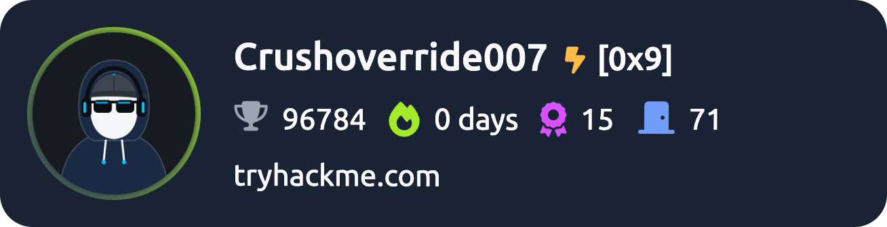

<!-- Introduction -->

<h3 align="center">Oh, Hello there 👋</h3>

  

  

<!-- Stats -->

  

  

  

 

<!-- The upstream host github-profile-trophy.vercel.app returns 402
     DEPLOYMENT_DISABLED. These are the maintainer's own load-balancing
     mirrors, listed in the project README; all three serve the same SVG:
       github-profile-trophy-orcin-eta.vercel.app  (in use)
       github-profile-trophy-unserori.vercel.app
       github-profile-repo.vercel.app
-->

  

 

  

 

  

 

<!-- Bio -->

## :mailbox_with_mail: Socials

* daily.dev profile

  

  
  

## :hourglass: Hobbies...

* Finding new skills to master
* Socializing with other tech enthusiasts
* Music-guru
* Might be a pro fifa player ;)

  

## ☁️ Skills - Cloud

## :recycle: Skills - Automation & Security

## :computer: Skills - OS

## :globe_with_meridians: Skills - WebDev

##  Version Control System

## :dart: :rocket: Project Management

 

---

<!-- Adding github activity graph -->

  
Activity Graph of the last 31 days of Crushoverride007

   
  <!-- Self-hosted fork of https://github.com/Ashutosh00710/github-readme-activity-graph
       The maintainer's own deployment returns 402 DEPLOYMENT_DISABLED. -->
  

 
